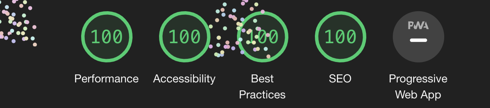

# DiPS Code Jam 2021

## What is DiPS Code Jam 2021?💡💡

DiPS Code Jam 2021 will be the first, one of its kind programming fest ever hosted by DPS Bangalore South. We believe that this contest will enable contestants to develop their problem-solving and analytical skills. Participants will also develop their logic-building and time management skills, and this competition will surely provide a competitive edge to the students as they begin to enter these coding fests at an early age.

## How was this website built?⚙️⚙️

DiPS Code Jam website was built using a traditional tech stack of HTML, SASS and vanilla JS. The major idea behind using this tech stack is to keep the website lightweight while giving the user a smooth yet astonishing feel. The website also utilises lightweight JS libraries like [https://greensock.com/gsap](GSAP) and [https://vincentgarreau.com/particles.js/](particles.JS) for animation and interaction purposes.

## Achievements of this project🎉🎊

The proudest achievement from this project was the feat of a perfect '100' Lighthouse score. This was the first project which has received a perfect '100' Lighthouse score. You can view more about Lighthouse [https://developers.google.com/web/tools/lighthouse](here).

## How can you use this website?

To use the DiPS Code Jam 2021 website open this [https://dpsitcouncil.tech/dipscodejam2021](link) in your desired browser and enjoy the scrolling and text animations!